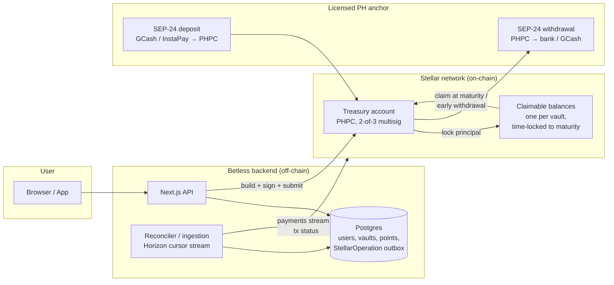
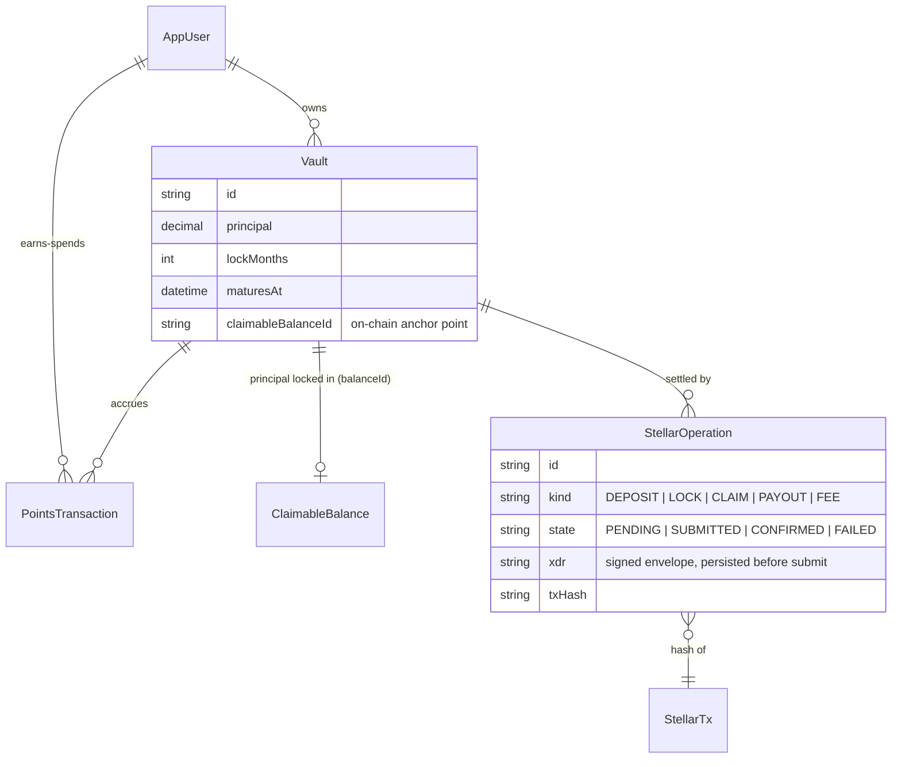
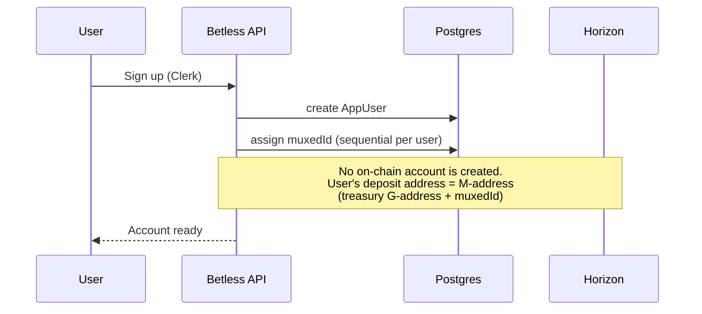
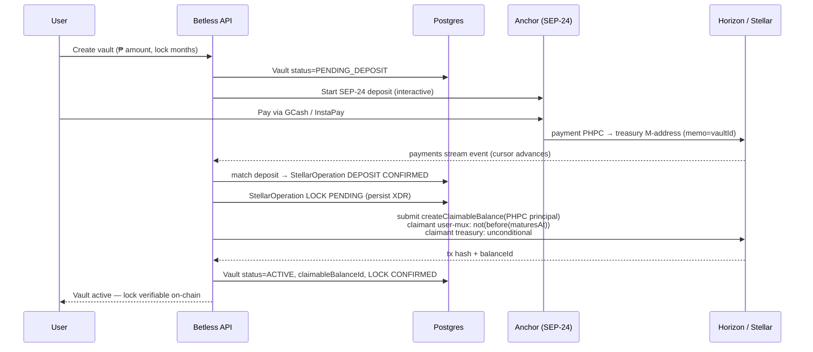
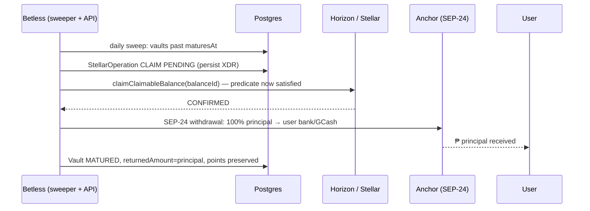
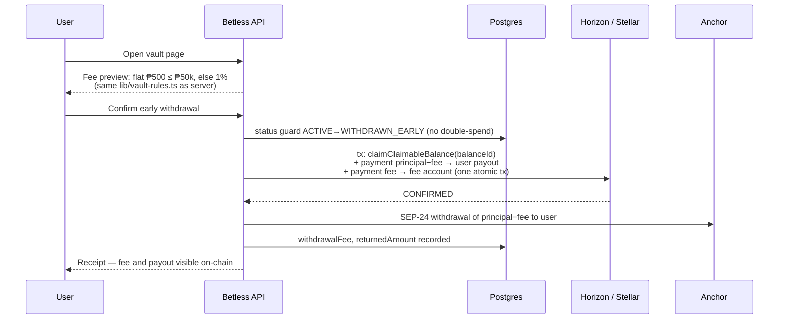

# Stellar Architecture for Betless

**Status:** Phases 1–2 implemented. The codebase now ships the `StellarOperation` outbox and claimable-balance vault locks (`services/stellar-service.ts`, `lib/stellar-config.ts`, `npm run stellar:setup` for testnet). The layer is optional: without Stellar environment variables the app runs fully off-chain. Anchor rails (SEP-24) and multisig treasury remain future work. This document is the audit of the previous Stellar integration, the reasoning for its removal, and the design that makes Stellar a load-bearing part of the commitment-savings platform.

**Implementation notes vs. this design:** claimable balances require regular (non-muxed) account claimants, and users are custodial with no on-chain accounts — so the two claimants on each vault lock are the **treasury** (time predicate `not(before(maturesAt))`, the enforced lock) and the **ops account** (unconditional, the early-withdrawal escape hatch, held as a separate signer). Deposits/payouts settle off-chain until an anchor integration exists.

---

## 1. Audit of the previous implementation

The pre-restructure integration (last present at commit `8c1b3dc`) used Stellar as follows:

| Component | What it did |
|---|---|
| `lib/stellar.ts` | Validated user-pasted public keys (`StrKey`) |
| Client wizard | Generated `Keypair.random()` in the browser; showed the secret once |
| `services/vault-funding-service.ts` | Funded the user's account with **testnet Friendbot** XLM |
| `services/stellar-proof-service.ts` | Sent a **0.0000001 XLM** "proof payment" from an optional server signer to the user's wallet and stored the hash as a receipt |
| `lib/stellar-explorer.ts` | Built stellar.expert links for the UI |
| `Vault.stellarNativeBalance` | Cached the XLM balance from Horizon |

### Verdict: decorative, not functional

- **No value moved on Stellar.** Peso amounts — the entire product — were rows in Postgres. The chain carried a dust payment whose only meaning was "this row exists," which the database already proved.
- **No rule was enforced on Stellar.** Lock periods, top-ups, and rewards were all application logic; the on-chain artifact enforced nothing.
- **Testnet in the product path.** Friendbot funding cannot exist on mainnet, so the flow was demo-only by construction.
- **One funded account per vault** wasted base reserves and pushed key management onto users (a secret shown once in a browser, with no recovery), for accounts that held nothing.
- **Fragile submission handling.** No timebounds, no persisted XDR for safe resubmission, no cursor-based ingestion — balance data was a one-shot cache.

This is why the restructure removed the integration rather than porting it: an audit layer that audits nothing is complexity without benefit. The right move is not "add the proof payments back" but to put the thing that matters — **the locked principal** — on the chain.

---

## 2. Where Stellar fits in the new architecture

**Principle: the chain custodies the money; the database runs the product.**

Stellar becomes the **custody, settlement, and lock-enforcement layer for vault principal**, using a peso stablecoin (below: `PHPC`, issued by a licensed Philippine anchor). Points, users, and the rewards catalog stay off-chain.



**Why this is the right division:** a Betless vault is "an amount that cannot move until a date." Stellar has that exact primitive natively — a **claimable balance with a `not(before(maturesAt))` time predicate** — with no smart contract required. Using it gives every user and auditor cryptographic proof that (a) the principal exists, (b) it is segregated per vault, and (c) it cannot silently move before maturity. That converts the marketing claim "your money comes back" into something verifiable.

---

## 3. On-chain vs. off-chain decisions

| Concern | Where | Why |
|---|---|---|
| Identity, auth | Off-chain (Clerk) | Regulatory KYC lives with the anchor; the app needs sessions, not keys |
| Vault principal | **On-chain** (PHPC claimable balance) | The core trust promise; time predicate enforces the lock natively |
| Deposits / payouts | **On-chain** settlement via anchor SEP-24 | Real peso rails in/out; each transfer is a public, memo-tagged record |
| Lock period | **On-chain** predicate + off-chain mirror | Chain enforces; DB mirrors for UX (progress bars, dates) |
| Early-withdrawal fee | Off-chain calculation, on-chain settlement | Fee formula is product policy; the split payment (user + treasury) is public |
| Points ledger | **Off-chain** (Postgres `PointsTransaction`) | Monthly accruals across all users are high-frequency dust with no external utility; spec demands "extremely simple." Putting them on-chain adds trustlines, reserves, and auth flags for zero user benefit |
| Rewards catalog + redemption | Off-chain | Fulfilled by merchants off-chain; a voucher code is not chain state |
| Custodial yield strategy | Off-chain (partner) | Deliberately abstract per the business model; users see points, not yields |

The honest rule applied here: **anything the user must trust goes on-chain; anything the product iterates on stays off.** Points values, catalog prices, and fee tiers will change; the principal promise will not.

---

## 4. Accounts, keys, and how records relate

### Account model

| Account | Created | Funded | Purpose |
|---|---|---|---|
| **Treasury** (`G...TREAS`) | Once, at platform setup | XLM for reserves/fees + PHPC trustline | Receives anchor deposits, creates/claims vault claimable balances, pays out |
| **Fee account** (optional, `G...FEES`) | Once | By treasury | Segregates collected early-withdrawal fees for clean accounting |
| **Per-user Stellar accounts** | **Not created** | — | Users are custodial. Deposits are attributed with **muxed addresses** (`M...` = treasury + user ID), so no per-user base reserves, no user key management |

Users never see a secret key. This is a deliberate reversal of the old design: the previous app made users custody a key for an account that held nothing; the new design has the platform custody an account that holds everything, with per-user attribution done by muxed IDs and transaction memos. (A future "export to self-custody" feature can create user accounts with **sponsored reserves** so users start at zero XLM.)

### Record relationships



Concretely, the Prisma additions are one column (`Vault.claimableBalanceId`) and one table (`StellarOperation`, the outbox). Nothing else in the shipped schema changes.

### Signing, security, key management

- **Treasury is 2-of-3 multisig.** A low-weight *ops signer* (weight 1) held by the backend signs routine operations; medium/high thresholds (weight 2) require a second signer held in a KMS/HSM, used by an approval step for payouts above a limit. Master key weight 0 after setup (cold-stored recovery via signer set, standard Stellar practice).
- **The ops secret never reaches the client.** It lives in the server environment/KMS; all signing happens server-side. There is no browser key generation anywhere in the design.
- **Every transaction gets timebounds** (e.g., `maxTime = now + 60s`), so a lost submission expires deterministically instead of lingering as a replayable envelope.
- **Signed XDR is persisted before first submission** (`StellarOperation.xdr`). Resubmitting the identical envelope is idempotent — same hash — which is the documented safe retry pattern.

---

## 5. Failure handling and network synchronization

**The outbox state machine** is the single mechanism for all on-chain writes:

```
PENDING ──submit──▶ SUBMITTED ──confirmed in ledger──▶ CONFIRMED
   │                    │
   │                    ├─ timeout / 504 ──▶ resubmit same XDR (idempotent)
   │                    └─ tx_bad_seq after timebounds ──▶ rebuild, new op, old marked FAILED
   └─ validation error ──▶ FAILED (surfaced to ops, never silently dropped)
```

- The app **writes intent to Postgres first**, then submits. A crash between the two leaves a `PENDING` row that a sweeper retries — money never moves without a record, and no record is stranded without resolution.
- **Deposits are detected by streaming** `GET /accounts/{treasury}/payments?cursor=X` (SSE) with the paging token persisted after each event, so ingestion resumes exactly where it stopped after a restart. Incoming payments are matched to users by muxed ID / memo; unmatched payments land in an ops review queue rather than being guessed at.
- **Nightly reconciliation** lists `GET /claimable_balances?claimant={treasury}` and compares against `ACTIVE` vaults. Any mismatch (missing balance, orphaned balance, amount drift) alerts ops. The database stays authoritative for UX; **the chain is authoritative for money.**
- **Partial failures degrade to Phase 0 behavior**: if Horizon is unreachable, vault creation can still record the vault as `PENDING_LOCK` and complete the on-chain lock when connectivity returns — users see accurate status, and the reconciler closes the gap.

---

## 6. SDKs, Horizon APIs, and services — and why each is required

| Dependency | Used for | Why required |
|---|---|---|
| `@stellar/stellar-sdk` (server only) | `TransactionBuilder`, `Operation.createClaimableBalance / claimClaimableBalance / payment`, `Claimant.predicateNot(predicateBeforeAbsoluteTime(...))`, muxed address encoding, XDR (de)serialization | The only piece that builds and signs envelopes; no client-side usage remains |
| Horizon `GET /accounts/{id}` | Treasury sequence number, trustline balances | Needed to build transactions and monitor float |
| Horizon `POST /transactions` | Submission | The write path |
| Horizon `GET /transactions/{hash}` | Confirmation polling for `SUBMITTED` ops | Deterministic settlement check |
| Horizon `GET /accounts/{id}/payments` (SSE, cursor) | Deposit ingestion, history | Resumable, ordered event stream |
| Horizon `GET /claimable_balances?claimant=` | Reconciliation, proof-of-reserves page | Direct view of every locked vault |
| Horizon `GET /fee_stats` | Fee bidding under surge | Keeps payouts moving during congestion |
| Anchor (SEP-24) | Peso on/off-ramp (GCash, InstaPay, bank) | The licensed fiat boundary; Betless never touches raw fiat rails |
| Friendbot | **Testnet only**, integration tests | Explicitly fenced out of production code paths |

Deliberately **not** used: **Soroban.** Time-locked custody, split payments, and multisig approvals are all classic primitives. A smart contract would add an audit surface, deployment lifecycle, and fee model for zero additional capability at this product's complexity. (If future products need conditional logic — e.g., purpose-locked payouts — Soroban is the escape hatch, not the default.)

---

## 7. Core flow sequence diagrams

### 7.1 Account creation



### 7.2 Vault creation + funding (deposit → lock)



The treasury's unconditional claimant is the operational escape hatch (early withdrawals, incident recovery). The user-facing promise is enforced by the time predicate on the user's claimant.

### 7.3 Rewards (points) — intentionally off-chain

```mermaid
sequenceDiagram
    participant U as User
    participant App as Betless API
    participant DB as Postgres

    U->>App: Any read (dashboard, summary)
    App->>App: syncVaults(): full months elapsed since startAt
    App->>DB: insert missing PointsTransaction rows<br/>(unique vaultId+monthIndex — idempotent)
    App-->>U: Balance = SUM(points)
    Note over App,DB: On-chain rationale: monthly micro-accruals ×<br/>all users = dust with no external utility.<br/>Principal is the trust surface; points are product surface.
```

### 7.4 Withdrawal — maturity (automatic return)



### 7.5 Withdrawal — early (fee displayed, then settled)



A multi-operation Stellar transaction makes claim + user payout + fee transfer **atomic** — there is no state where the balance is claimed but the user's share is unpaid.

### 7.6 Transaction history

```mermaid
sequenceDiagram
    participant H as Horizon
    participant Ing as Ingestion worker
    participant DB as Postgres
    participant U as User

    H-->>Ing: SSE /payments?cursor=last_token
    Ing->>DB: upsert StellarOperation by txHash (idempotent)
    Ing->>DB: persist new cursor
    U->>DB: Dashboard "activity"
    DB-->>U: merged view: PointsTransactions (off-chain)<br/>+ StellarOperations (on-chain, with stellar.expert links)
    Note over U: Every peso movement links to a public<br/>explorer record; points rows do not, by design.
```

---

## 8. Review against Stellar best practices — gaps and opportunities

Old-implementation violations, and how the target design resolves them:

| # | Best practice | Old implementation | Target design |
|---|---|---|---|
| 1 | Don't ship testnet dependencies in product flows | Friendbot funding in the vault path | Friendbot fenced to tests; funding via anchor rails |
| 2 | Transactions need timebounds + persisted XDR for safe retry | Neither; fire-and-forget submit | Outbox with XDR, timebounds, idempotent resubmission |
| 3 | Ingest with cursors, not one-shot reads | Cached balance snapshot | SSE payments stream with persisted paging token |
| 4 | Minimize base-reserve footprint | One funded account per vault | Zero per-user accounts (muxed attribution); sponsored reserves if self-custody export ships later |
| 5 | Never put users in charge of keys without recovery | Browser-generated secret shown once | Fully custodial; server-side multisig signing |
| 6 | Use native primitives before contracts | Dust payments as "proof" | Claimable balances *are* the vault — the primitive enforces the product rule |
| 7 | Memo/muxed discipline for custodial deposits | N/A | Muxed IDs + `memo=vaultId`, unmatched-payment ops queue |
| 8 | Public auditability where you make a trust claim | Explorer link to a dust tx | Proof-of-reserves: every active vault is a queryable claimable balance |

**Missed opportunities worth taking (in order):**

1. **Phase 1 — treasury + memo-tagged settlement (small):** even before claimable balances, doing deposits/payouts in PHPC through the treasury with `memo=vaultId` gives a public, per-vault money trail. ~1 new table, 1 worker.
2. **Phase 2 — claimable-balance locks (the differentiator):** on-chain lock enforcement and a public "verify my vault" page. This is what makes Stellar *meaningful* here rather than incidental.
3. **Phase 3 — optional:** self-custody export via sponsored reserves; points as an `auth_required` + `clawback`-enabled asset **only if** partner merchants want to accept points directly (until then it is complexity without a customer).

**Not recommended:** Soroban contracts for vault logic (native primitives suffice), on-chain points accrual (dust), per-user Stellar accounts by default (reserve waste + key UX), and reviving proof-payment receipts in any form.

---

## 9. Summary — how and why Stellar powers Betless

> A Betless vault is a promise: *"your money is locked until this date, then it all comes back."* Stellar is the only part of the stack that can make that promise **verifiable by anyone** — the principal sits in a claimable balance whose time predicate the network itself enforces, funded and repaid over licensed anchor rails, with every movement publicly traceable by memo. The database orchestrates the product (users, points, catalog, fees); the ledger holds the money. Neither pretends to do the other's job.
